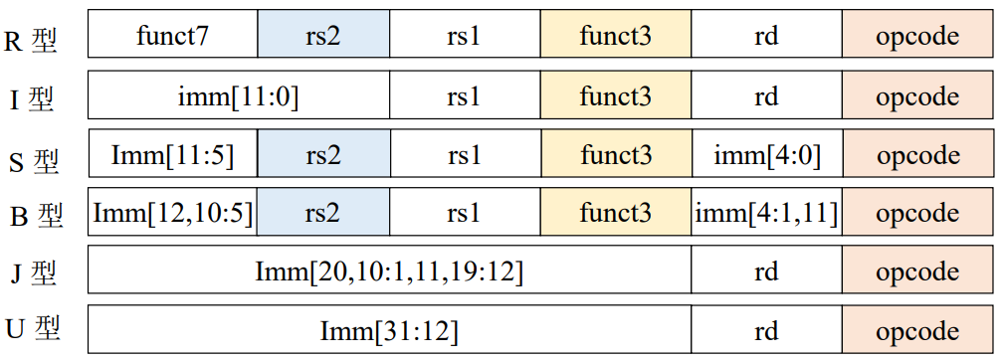

# 第二章 RISC-V 汇编及其指令系统

## 计算机中数的表示

### 无符号数和有符号数

- 无符号数 2：$2_{(10)} = 00000010_{(2)}$

- 寄存器的位数反映无符号数的表示范围：8 位：0-255；16 位：0-65535

#### 真值与机器数

真值：带符号的数；如 -1100，-0.1011

机器数：符号数字化的数

- 符号位：正数用前缀 0 表示，负数用前缀 1 表示。
- 小数点位置：对于小数，小数点在符号位的后面；对于整数，小数点在数值的最后一位。


**这里提到的是纯小数和纯整数，并未涉及既有整数又有小数的数据。**

#### 原码/补码/反码/移码表示法

***更多练习见 PPT。***

##### 原码表示法

###### 原码表示法：整数

用逗号将符号位和数值部分隔开。

$x = +1110 \, [x]_{原} = 0,1110$

$x = -1110 \, [x]_{原} = 1,1110$

*x 是真值，n 是数值位数。*
$$
\begin{equation}
[x]_{原} = \begin{cases}
0, & \text{if } 2^n > x \ge 0; \\
2^n - x, & \text{if } 0 \ge x \ge -2^n.
\end{cases}
\end{equation}
$$
eg：$[x]_{原} = 2^4 - (1110) = 1,1110$

###### 原码表示法：小数

用小数点将符号位和数值部分隔开。

$x = -0.1101 \, [x]_{原} = 1.1101$

*x 是真值。*
$$
\begin{equation}
[x]_{原} = \begin{cases}
x, & \text{if } 1 > x \ge 0; \\
1 - x, & \text{if } 0 \ge x > -1.
\end{cases}
\end{equation}
$$

###### x = 0 的原码

**x = 0 的原码要分成小数和整数分别讨论。**

对于整数 0（假设整数的数值位是 4 位）：$[+0]_{原} = 0,0000 \, [-0]_{原} = 1,0000$

对于小数 0（假设小数的数值位是 4 位）：$[+0.0000]_{原} = 0.0000 \, [-0.0000]_{原} = 1.0000$

+0 和 -0 原码不一样。

###### 原码优缺点

优点：简单、直观。

缺点：

- +0 和 -0 原码不一样。

- 正数和负数相加的运算要先判断结果符号再对绝对值相减；原码直接运算和十进制运算不等。

##### 补码表示法

###### 补码表示法：整数

- 例：将时钟从 5 点调到 3 点

- 补的概念：时钟以 12 为模

  - 逆时针：5 – 2 = 3

  - 顺时针：5 + 10 = 3 + 12

- 可见 -2 可用 +10 代替

  - 称 +10 是 -2（以 12 为模）的补数，记作 -2 ≡ +10（mod 12）
  - 同理 -4 ≡ +8 （mod 12）；-5 ≡ +7 （mod 12）

- 结论（真值的绝对值小于模）

  - 一个负数加上“**模**”即得该负数的补数。

  - 一个负数和一个正数互为补数时，**绝对值之和**即为模数。
  - 正数的补数即为其本身。

- 约定：正数的补数有前缀 0，负数的补数有前缀 1。

*x 为真值，n 为二进制整数的位数。*
$$
\begin{equation}
[x]_{补} = \begin{cases}
0,x, & \text{if } 2^n > x \ge 0; \\
2^{n+1} + x, & \text{if } 0 > x \ge -2^n (\mod 2^{n+1}).
\end{cases}
\end{equation}
$$

###### 补码表示法：（纯）小数

$$
\begin{equation}
[x]_{补} = \begin{cases}
x, & \text{if } 1 > x \ge 0; \\
2 + x, & \text{if } 0 > x \ge -1 (\mod 2).
\end{cases}
\end{equation}
$$

###### 求补码的快捷方式

当真值为负时，补码可用原码除符号位外每位取反，末位加 1 求得。

###### 举例：已知小数补码求真值

结论：当真值为负时，已知补码求原码的快捷方法：

- 补码除符号位外，每位取反，末位加 1。

- 补码除符号位外，末位减 1，再每位取反。

##### 反码表示法

**加上符号位，数值位按位取反。**

###### 反码表示法：二进制整数

公式略。但可参考补码公式，减 1 即可。

###### 反码表示法：二进制小数

公式略。

###### 求 0 的反码

对于整数 0（假设整数的数值位是 4 位）：$[+0]_{反} = 0,0000 \, [-0]_{反} = 1,1111$

对于小数 0（假设小数的数值位是 4 位）：$[+0.0000]_{反} = 0.0000 \, [-0.0000]_{反} = 1.1111$

+0 和 -0 反码不一样。

##### 三种机器数的小结


- 最高位为符号位，书写上用“,”（整数）或“.”（小数）将数值部分和符号位隔开

- **对于正数，符号位为 0，原码 = 补码 = 反码**

- 对于负数 ，符号位为 1，其数值部分
  - 原码除符号位外每位取反 -> 反码
  - 反码末位加 1 -> 补码
- 当真值为负时，已知补码求原码的方法：
  - 补码除符号位外，每位取反，末位加 1
  - 补码除符号位外，末位减 1，再每位取反

##### 移码表示法

补码表示很难直接判断其真值大小。

*x 为真值，n 为 整数的位数。*

$[x]_{移} = 2^n + x \, (2^n > x \ge -2^n)$

eg：$[-1100100]_{移} = 2^7 + (-1100100) = 0,0011100$

且：$[-1100100]_{补} = 2^{7+1} + (-1100100) = 1,0011100$

**补码与移码只差一个符号位。**

$[+0]_{补} = [-0]_{补}$

最小真值的移码为全 0：最小真值 $-2^5 = -100000$ 对应的移码为 $2^5 – 100000 = 000000$。

可用移码思想表示浮点数的阶码，便于判断浮点数阶码大小。

***最后，更多练习见 PPT。***

### 定点表示和浮点表示

定点表示：小数点按约定方式标出。

- 对于小数，小数点位置在符号位后；
- 对于整数，小数点位置在数值位后。

#### 浮点表示

浮点数的一般形式：

$N = S \times r^j$

S 为尾数，j 为阶码，r 为基数（基值）；计算机中 r 取 2，4，8，16 等。

计算机中 S 为小数，可正可负；j 为整数，可正可负。

eg：当 r = 2 时，
$$
\begin{align*}
N ={} & 11.0101\\
  ={} & 0.110101 \times 2^{10} \\
  ={} & 1.10101 \times 2^1 \\
  ={} & 1101.01 \times 2^{-10} \\
  ={} & 0.00110101 \times 2^{100} \\
\end{align*}
$$

### IEEE754 标准

### 算数移位与逻辑移位

移位的例子：15 . m = 1500 . cm

- 机器用语：15 相对于小数点 左移 2 位（小数点不动）
- 左移，绝对值扩大；右移，绝对值缩小。

移位的意义：在计算机中，移位与加减配合，能够实现乘除运算。

#### 算术移位规则

- **符号位不变**。

- **机器数的移位与真值移位一致**。

**移位规则表**：

| 真值 |      码 制       |   添补代码    |
| :--: | :--------------: | :-----------: |
| 正数 | 原码、补码、反码 |       0       |
|      |      原 码       |       0       |
|  负  |        补        | **左移 添 0** |
|  数  |        码        | **右移 添 1** |
|      |      反 码       |       1       |

***更多练习见 PPT。***

#### 算术移位的硬件实现

***图示见 PPT。***

#### 算术移位和逻辑移位的区别

- 算术移位：有符号数的移位

- 逻辑移位：**无符号数**的移位
  - 逻辑左移：低位添 0，高位移丢
  - 逻辑右移：高位添 0，低位移丢

## RISC-V 概述

### 指令系统的基本概念（科普）

- 机器指令（指令）

- 指令系统（指令集，IS: Instruction Set）

- **指令集架构（ISA: Instruction Set Architecture）**
  - 抽象层，软件子系统与硬件子系统的的桥梁和接口。

- 系列机

#### 指令集架构

- 指令集架构(ISA)位宽
- 计算机指令系统层次
- 指令系统的评价
- 有关ISA的若干问题
  - 存储器寻址
  - 操作数的类型
  - 所支持的操作
  - 控制转移类指令
  - 指令格式

### 主流指令集及发展方向（科普）

。。。。。。

### RISC-V 指令集（正式学习）

- RISC-V 指令集历史
- RISC-V ISA 设计理念——通用的 ISA
  - **完全开源**
- RISC-V 架构的特点
  - 指令集架构简单
  - 模块化的指令集设计
- RISC-V 的**模块化**设计
- 模块化的 RISC-V 指令子集
- 可配置的寄存器组
- 规整的指令编码
- RISC-V 的数据传输指令
- RISC-V 的特权模式
- RISC-V 的指令：http://riscvbook.com/chinese/RISC-V-Reader-Chinese-v2p1.pdf

#### 小结

- 完全开放的 ISA
- 精简
  - 包含一个最小的 ISA 固定核心 （可支撑 OS，方便教学）
  - 适合硬件实现，而不仅仅是适用于模拟或者二进制翻译
- 后发优势
  - 模块化的可扩展指令集
  - 简化硬件实现，提升性能
  - 更规整的指令编码、更简洁的运算指令、更简洁的访存模式：Load/Store 架构
  - 高效分支跳转指令（减少指令数目）、简洁的子程序调用
  - 无条件码执行、无分支延迟槽

## RISC-V 汇编语言

### 汇编语言简介

在汇编语言中，用助记符代替机器指令的 操作码，用地址符号或标号代替指令或操作数的地址。

编译器、汇编器；链接器、加载器、动态链接库...

汇编器：将汇编语言转换为目标文件，该目标文件是机器指令、数据和将指令正确放入内存所需信息的组合。

- 汇编器还可以处理机器指令的常见变体，这类指令称为**伪指令**。如：

  - |   li x9, 123    |  汇编器将其转化为 addi x9, x0, 123   |
    | :-------------: | :----------------------------------: |
    |   mv x11, x10   |  汇编器将其转化为 addi x11, x10, 0   |
    | and x9, x10, 15 | 汇编器将其转化为 andi x9, x10, 15 19 |

- **伪指令为 RISC-V 提供了比硬件实现更丰富的汇编语言指令系统**。

### RISC-V 汇编指令概览

#### RISC-V 汇编指令格式

- 通用指令格式：**op dst, src1, src2**

  - 1 个操作码，3 个操作数

  - op（**op**eration）：操作的名字

  - dst（destination）：目标寄存器

  - src1（source）：第一个源操作数寄存器

  - src2：第二个源操作数寄存器

- 通过一些限制来保持硬件简单
  - 硬件设计基本原则之一：简单源于规整
- **每一条指令只有一个操作，每一行最多一条指令**
- 汇编指令与 C 语言的操作相关（=, +, -, * , /, &, |, 等）
  - C 语言中的操作会被分解为一条或者多条汇编指令
  - C 语言中的一行程序会被编译为多行 RISC-V 汇编程序

#### RISC-V 汇编指令操作对象

- 寄存器

  - 32 个通用寄存器，x0 ~ x31（**注意：仅涉及 RV32I 的通用寄存器组**）

  - 在 RISC-V 中，算术逻辑运算所操作的数据必须直接来自寄存器
  - x0 是一个特殊的寄存器，只用于全零
  - 每一个寄存器都有**别名**便于软件使用，实际硬件并没有任何区别

- 内存

  - 可以执行在寄存器和内存之间的数据读写操作
  - 读写操作使用字节（Byte）为基本单位进行寻址
  - RV64 可以访问最多 $2^{64}$ 个字节的内存空间，即 $ 2^{61}$ 个存储单元

#### 汇编语言的变量——寄存器

- 汇编语言不能使用变量（C、JAVA 可以）
  - C 语言：int a; float b;
  - 汇编语言：寄存器变量没有数据类型

- 汇编语言的**操作对象以寄存器为主**

  - 好处：寄存器是最快的数据单元

  - 缺陷：寄存器数量有限，需要充分和高效地使用各寄存器

- 32 个 RISC-V 寄存器

| 寄存器  | 助记符 |               注解               |
| :-----: | :----: | :------------------------------: |
|   x0    |  zero  |            固定值为0             |
|   x1    |   ra   |     返回地址(Return Address)     |
|   x2    |   sp   |      栈指针(Stack Pointer)       |
|   x3    |   gp   |     全局指针(Global Pointer)     |
|   x4    |   tp   |     线程指针(Thread Pointer)     |
|  x5-x7  | t0-t2  |            临时寄存器            |
|   x8    | s0/fp  | save寄存器/帧指针(Frame Pointer) |
|   x9    |   s1   |           save 寄存器            |
| x10-x11 | a0-a1  |      函数参数 / 函数返回值       |
| x12-x17 | a2-a7  |             函数参数             |
| x18-x27 | s2-s11 |           save 寄存器            |
| x28-x31 | t3-t6  |            临时寄存器            |

### RISC-V 常用汇编指令

*助记符后缀：i = “immediate” 是个整型的常量，u = “unsigned” 无符号类型*

- 算术运算：add、sub（减法）、addi、mul（乘法）、div

- 逻辑运算：and、or、xor（异或）、andi、ori、xori

- 移位操作：sll、srl、sra、slli、srli、sra
  - s 是 shift（转移）；第一个 l 是 left，第二个 l 是 logical；a 是 arithmetic。

- 数据传输：ld、sd、lw、sw、lwu、lh、lhu、sh、lb、lbu、sb、lui
  - l 是 load（装载），s 是 save / store（存储）；
  - d 是 double（64 位，双字），w 是 word（32 位，单字），h 是 half（16 位，半字），b 是 byte（8 位，字节）；

- 比较指令：slt、slti、sltu、sltiu
  - Set Less Than...

- 条件分支：beq、bne、blt、bge、bltu、bgeu

- **无条件跳转：jal、jalr**
  - jal：jump and link；jalr：jump and link register
  - 伪指令 j Label


***具体讲解，例子见 PPT。***

**条件分支和无条件跳转建议配合 if-else 和循环语句一起看，开了[新文档](2.1.md)讲解。**

#### 注意事项 1

- 寄存器的位数是由指令集架构决定的，如 RISC-V 中就有 RV-32I 和 RV-64I 两种指令集。如果是 RV-32I，则寄存器里能存放 32 位二进制数，是 RV-64I，则寄存器里能存放 64 位二进制数。不仅是寄存器，操作码 op 转换为机器码时，也是转换为对应 32/64 位数据。

  *如下图第一行，0000001 000 0110011，这三块的组合共同表示操作码 mul。*

  

- **\# 符号后面是程序的注释**

- 指令执行顺序反映了源程序的计算过程

- 指令中可以看到如何使用临时寄存器

- 一个简单的 C 语言表达式变成多条汇编语句

- PC 指的是本条指令的地址，由于指令地址的长度为 4，所以下一条指令的地址为 PC + 4

  

- **数据在寄存器和主存中的储存形式是补码，补码参与运算；如果使用带 u 的操作码，则将其视为无符号数处理。**

  - eg：-5 在寄存器中存储为 0xfffffffb，解释
    - 0x 指十六进制；
    - 十六进制转二进制：每一位十六进制数用四位相应的二进制数表示
      - $ffff\_fffb_{(16)} = 1111\_1111\_1111\_1111\_1111\_1111\_1111\_1011$
    - 补码转化为真值：$- 0000\_0000\_0000\_0000\_0000\_0000\_0000\_0101$
    - 但是如果将其视为无符号数，那么 0xfffffffb 显然就会表示为另外一个很大的数了。

#### 注意事项 2：特殊的寄存器 x0（zero）

- 0 在程序中很常见，拥有一个自己的寄存器（x0）
- x0 是一个特殊的寄存器，值恒为 0，且不能被改变
  - 注意，在任意指令中，如果使用 x0 作为目标寄存器，将没有任何效果，仍然保持 0 不变
- 使用样例
  - add x3，x0，x0 # x3 = 0
  - add x1，x2，x0 # x1 = x2
  - add x0，x0，x0 # nop
- **0 寄存器是“加速经常 性事件”的典型实例**

#### 注意事项 3：RISC-V 中的立即数

- 数值常数被称为立即数（immediates）

- 立即数有特殊的指令语法：**opi** dst，src，imm

- 操作码的最后一个字符为 i 的，会将第二个操作数认为是一个立即数（经常用后缀来指明操作数的类型，例如无符号数 unsigned 的后缀为 u）

- 指令举例
  - addi x1，x2，5 # x1 = x2 + 5
  - addi x3，x3，1 # x3 = x3 + 1

- 在逻辑运算中，与立即数相关的操作需要先将立即数用符号位拓展。

  - 如 8，八位二进制数表示为 0000_1000，那么拓展为 32 位就是在前面再添加 24 个 0；

  - 如果是 -8，八位二进制数（**补码**）表示为 1111_1000，那么拓展为 32 位就是在前面再添加 24 个 1；

  - |  -8  |    8 位    |        16 位         |
    | :--: | :--------: | :------------------: |
    | 原码 | 1,000_1000 | 1,000_0000_0000_1000 |
    | 补码 | 1,111_1000 | 1,111_1111_1111_1000 |
  
    *-8 一直是 -8 ，补码也应该和位数无关，所以能拓展的就是符号位，很合理吧。*

#### 注意事项 4：数据传输

- 汇编语言的**操作对象以寄存器为主**，那么使用内存势必有寄存器和内存的数据传输

- C 语言中的变量会映射到寄存器中；而其它大量的数据结构，例如数组会映射到主存中
  - 主存可以看作是一维的数组，地址从 0 开始
  - **除数据传输指令外**的 RISC-V 指令**只在寄存器**中操作
  - 数据传输指令专门在寄存器和主存之间传输数据
  - Store 指令：寄存器的数据存储到主存
  - Load 指令：主存的数据传输到寄存器


#### 注意事项 5：主存的字节寻址方式

- 单位制
  - 最小的单位是 bit；
  - 再就是 1 byte(字节) = 8 bits，1 word(字) = 32 bits = 4 bytes；
  - 另外 1 half = 16 bits = 2 bytes，1 double = 64 bits = 8 bytes，1 int = 32 bits = 4 bytes；

- 在现代计算机中操作以一个字节（8 bits）为基本单位
  - 不同的体系结构对字（word）的定义不同，RV中 1 word = 4 bytes
  - 主存按照**字节**（不是字）进行编址
- 字地址之间有 4 个字节的距离
  - 字的地址为字内最低位字节的地址(小端模式)
  - 按字对齐，地址最后两位为 0（4 的倍数）
  - C 语言会自动按照数据类型来计算地址，在汇编中需要程序员自己计算
- **数据传输指令相关：offset(bAddrReg)：bAddrReg + offset 按字对齐，即 4 的倍数**
  - eg：数组 A[10] 基地址 &A[0] 储存在寄存器 x9，如何访问 A[2]（并存储在 x5 中）？
  - 答：lw x5，8(x9)；A[2] 的地址为基址寄存器 x9 + 偏移量 8

#### 注意事项 6：传输一个字节数据

1. 使用字类型指令，配合位的掩码来达到目的
   - lw x11, 0(x1)
   - andi x11, x11, 0xFF # lowest byte
   - 解释：0xFF 即 1111_1111，拓展后前面的位数皆为 0，故而在按位与时，只有最后 8 位能够保存下来，也就是 1 个字节。
2. 使用字节传输指令（*注意：字节传输指令无需字对齐*）
   - lb x11, 1(x1)
   - sb x11, 0(x1)
3. 进一步，x11 中的字节数据也是补码形式，故而**同样拓展符号位**。

#### 注意事项 7：字节排布

- 大端：最高的字节在最低的地址，字的地址等于最高字节的地址

- 小端：最低的字节在最低的地址，字的地址等于最低字节的地址

#### 注意事项 8：RISC-V 汇编中的伪指令

- 方便程序员编程
- 非直接硬件实现的指令，需要通过汇编器翻译为实际的硬件指令
  - 每一条伪指令会被翻译为 1 条或者多条硬件指令
- 在汇编中，伪指令和硬件指令**可以混用**。

#### 注意事项 9：没有的指令

**如果一个操作可以分解成一个更简单的操作，不要包含它。**

1. 没有立即数减法指令：addi x3, x4, -10 # f = g - 10
2. 没有 NOT（取非）：
   - 某数的”取反（非）”等价于其和 $1111 \dots 1111_2$ 的 **xori**
   - 例：xori x5, x6, -1 # x5 = x6
3. 没有算术左移指令

### 函数调用（难点）

- 函数（过程）调用的 6 个步骤
  - 将参数放在过程函数(被调用者)可以访问到的位置（x10~x17）
  - 将控制转交给过程函数（被调用者）
  - 获取过程函数（被调用者）所需的存储资源
  - 执行过程函数（被调用者）中的操作
  - 将结果值放在调用程序（调用者）可以访问到的寄存器
  - 返回调用位置（x1 中保存的地址）

- 调用子程序包含两个参与者
  - 调用者（caller）
    - 准备函数参数，跳转到被调用者子程序
  - 被调用者（callee）
    - 使用调用者提供的参数，然后运行
    - 运行结束保存返回值
    - 将控制（如跳回）还给调用者

- RISC-V 过程调用中的常用寄存器

  |                | 助记符 |      注解      |    寄存器     |
  | :------------: | :----: | :------------: | :-----------: |
  | 返回地址寄存器 |   ra   | Return Address |      x1       |
  |   参数寄存器   | a0-a7  |   arguments    |    x10-x17    |
  |  返回值寄存器  | a0-a1  |       -        |    x10-x11    |
  |   保存寄存器   | s0-s11 |      save      | x8,x9,x18-x27 |
  |   临时寄存器   | t0-t6  |   temporary    | x5-x7,x28-x31 |
  |     栈指针     |   sp   | Stack Pointer  |      x2       |

- RISC-V 中函数调用要考虑的问题
  - 高级语言函数体中一般使用局部变量
  - RISC-V 汇编子程序使用**寄存器（全局变量）**
  - 调用者(Caller)和被调用者(Callee)可能使用相同寄存器
    - 造成数据破坏
    - 被调用函数需要保存可能被破坏的寄存器（现场）
    - 哪些寄存器属于现场？
- 函数调用需保存的数据
  - 函数调用需要保存哪些（寄存器）数据？
    - 需要保存的参数/save 寄存器的值。
    - 函数执行完成后，返回下一条“指令”的地址。
    - 其他局部变量（例如函数中使用的数组或结构体）的空间

### 栈的使用（难点）

- 在调用函数之前需要一个保存旧值的地方，在返回时还原它们。在 RISC-V 中使用栈来完成这个功能。

- 栈：后进先出（LIFO：Last In First Out）队列

  - 入栈：将数据放入栈
  - 出栈：从栈中取出数据

- 函数调用时栈的变化

  - 按历史惯例，RISC-V 中栈按照从高到低的地址顺序增长（即栈底位于高地址，栈顶位于低地址）。
  - sp（x2 寄存器）是RISC-V中的栈指针寄存器，用来保存栈顶的地址。
  - 入栈向下移动栈指针(减 sp), 出栈向上移动栈指针(增 sp)。

- 栈的使用

  - 寄存器 sp 总是指向栈中最后使用的空间

  - 在使用 stack，首先将这个指针减少所需的空间量，然后填入需要保存的信息。

  - eg 1：将保存寄存器 x9(RV-32) 的内容入栈

    ```asm
    addi sp, sp, -4 # 将栈指针sp向低地址移动4个字节(RV-32)
    sw x9, 0(sp) # 将寄存器x9中的内容写入栈
    ```

  - eg 2：多个数据入栈，出栈（In RISC-64）
  
    
  
    ```asm
    addi sp, sp, -24
    sd x5, 16(sp)
    sd x6, 8(sp)
    sd x20,0(sp)
    ```
  
    ```asm
    addi sp, sp, -24
    sd x5, 16(sp)
    sd x6, 8(sp)
    sd x20,0(sp)
    ```

- 内存布局（为什么栈按照从高到低的地址顺序增长）

  |                                                              |                                                              |
  | ------------------------------------------------------------ | ------------------------------------------------------------ |
  |  | 栈区：自动存储<br/>动态数据区：堆<br/>静态数据区：全局变量<br/>代码区：程序代码<br/> |

  - 代码区：程序代码
  - 静态数据区：全局变量
    - 例如 C 中的静态变量、常数组和字符串
    - x3（全局指针）初始化为适当的地址，加上正负偏移量可以访问这段内存空间
  - 动态数据区：堆
    - 例如C中的 malloc、Java 中的 new
  - 栈区：自动存储

### 编译工具介绍

- 一个完整的 RISC-V 汇编程序有多条语句（statement）组成。
- 一条典型的 RISC-V 汇编语句由3部分组成：
  - label（标号）
  - operation（操作码）
  - comment（注释）: 常用方式，“#” 开始到当前行结束。
- 我们主要使用 RARS (RISC-V 汇编程序和运行时模拟器) 是一个轻量级的交互式集成开发环境 (IDE)，用于使用 RISC-V 汇编语言进行编程，具有代码提示，模拟运行，调试，统计等功能。

*详细使用介绍见 PPT。*

## RISC-V 指令表示

***具体讲解见 PPT，难得的逻辑清晰。***

### RISC-V 六种指令格式

- `addi x10, x0, 0` 是一条指令，会被表示为一串二进制数。

  - 指令长度**固定为 32 位**，与寄存器位宽无关，即不管操作的是 32 位还是 64 位。

- 指令中**操作码**和**操作数**可分成多个“字段”（一部分位）

  - 每个字段有特定的含义和作用
  - 理论上可以为每条指令定义不同的字段

- RISC-V 定义了六种基本类型的指令格式：

  - R 型指令：用于**寄存器** - 寄存器操作；Register-register arithmetic/logical operations
  - I 型指令：用于短**立即数**和访存 load 操作；register-Immediate arith/logical operations & loads
  - S 型指令：用于访存 store 操作；for Stores
  - B 型指令：用于条件**跳转/分支/转移**操作；for Branches(SB 型?)
  - U 型指令：用于**长**立即数操作；for 20-bit Upper immediate instructions
  - J 型指令：用于**无条件跳转**操作；for Jumps (UJ 型?)

- 会查表

  

#### 注意事项 1

- opcode(操作码)：指定它是哪类指令，同一种指令的 opcode 都是相同的，且固定为 7 位。

  - 如：对于所有R型指令，此字段等于 0110011

- Reg（寄存器）：保存一个 5 位无符号整数（0-31），对应于一个**寄存器号**（x0-x31）

  - 如：`add x18,x19,x10`，那么 rs2 的位置是 x10，就保存 01010。

- 很多类型的指令可以以 R 型指令为基础记忆。

  

### RISC-V 寻址模式介绍

1. 操作数是指令本身的常量
2. 操作数在寄存器中
3. 操作数于内存中，其地址是寄存器和指令中的常量之和
4. 分支地址是 PC 与指令中立即数之和

## 案例分析

### [RISC-V 冒泡排序](2.2.md)

### [数组与指针](2.3.md)
