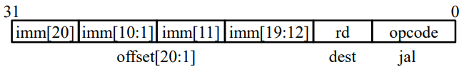

# 第四章 处理器设计

- Processor：处理器
  - Control：控制器
  - Datapath：数据通路
    - PC 寄存器
    - Registers：寄存器堆
    - ALU(Arithmetic & Logic Unit)：算术逻辑单元
- Cache：缓存

- Memory：主存
  - **一部分放 Program（程序），一部分放 Data（数据）**

- Input / Output：输入 / 输出

## 处理器设计的需求分析

CPU 功能层面的定义：构建一个能够通过输入的机器码，执行相应操作、并保持相应状态的**数字电路**。

eg：RISC-V 机器码 0x00600293(addi t0, x0, 6)，执行完这条指令后，寄存器 t0 的值为 6。

大概的过程是：CPU 从 主存或者 cache 中读取了这条指令，从 CPU 内部看则是控制器从主存或者 cache 中读取了这条指令，然后存入 PC 寄存器，然后数据通路去执行这条指令。

### CPU 的组成部分

- **数据通路**(datapath)是处理器中执行操作的硬件 ≈≈ 处理器的四肢
  - 执行控制器的操作（例如，控制器告诉数据通路，执行 addi 指令，则数据通路就会将操作数传递给加法器）
- **控制器**是对数据通路要做什么操作进行调度的硬件结构 ≈≈ 处理器的大脑
  - 告诉数据通路：需要执行什么操作？需要读内存吗？读哪个寄存器？需要写寄存器吗？写哪个寄存器？

### 处理器设计步骤

1. 分析指令系统，得出对数据通路的需求
2. 为数据通路选择合适的组件
3. 根据指令需求连接组件建立数据通路
4. 分析每条指令的实现，以确定控制信号
5. 集成控制信号，形成完整的控制逻辑

### RISC-V 指令格式回顾及需求

- R 型指令： `op dst, src1, src2`
  - 需求：常用**算术逻辑运算**，可读写的寄存器，可同时读 2 个，写 1 个。

- I 型指令： `opi dst, src, imm # R[dst]=R[src] + s-ext(imm)`
  - `load dst，offset(bAddrReg) # R[dst]=mem[R[bAddrReg] + offset]`
  - `jalr rd, offset(rs1) # R[rd]=PC + 4, PC = R[rs1] + offset`
  - 新增需求：**立即数扩展、PC 寄存器、存储器可读、加法器**...
- S 型指令：`store src, offset(bAddrReg) # mem[R[bAddrReg] + offset]=R[src]`
  - 新增需求：存储器**可写**、立即数生成器（包括扩展等）
- B 型指令：`bxx src1,src2, label`
  - 新增需求：**多路选择器**、**功能更多**的立即数（扩展）生成器
- J 型指令：`jal rd, offset`
- U 型指令：将长立即数加到 PC 并写入目的寄存器
  - 新增需求：功能更多的立即数生成器 ....

### RISC-V 指令系统的需求

- 算术逻辑单元（ALU）
- 运算类型：加、减、或、比较等各种运算
- 立即数扩展（生成）器
- 零扩展、符号扩展等
- 程序计数器（PC）
- **存储组件**：**寄存器堆**(Register File，简写为 **RF**)，存储器(Memory)

## RISC-V 数据通路的组件选择

### 数据通路模块

- 组合逻辑单元
  - 处理数据值的单元
  - **无内部存储功能**
  - 输出**仅依赖于输入**：输入相同， 则输出相同
  - 如 AND 门、ALU 等
- 状态与时序单元
  - 一个存储单元
  - **有内部存储功能，即包含“状态”**
  - 如指令存储器、数据存储器以及寄存器

### 数据通路模块——状态与时序单元

寄存器堆和存储器是最典型的状态与时序单元。

时序，单元受时序控制；状态，单元能够存储状态。

图中，当时钟沿信号处于上升沿，且写使能有效时，才能被写入数据。

### 冯诺依曼架构 vs 哈佛架构

- 冯诺依曼架构（以 X86 为代表）

  - 也叫普林斯顿架构，程序空间和数据空间是一体的，数据和程序采用同 一数据总线和地址总线。

  - 指令和数据的宽度相同。

  - 指令和数不能同时进行操作，只能顺序执行。

  - 

- 哈佛架构（以 DSP 和 ARM 为代表）
  - 存储器分为数据存储器和程序存储器，总线分为程序存储器的数据总线和地址总线以及数据存储器的数据总线和地址总线。
  - 可同时对数据和程序进行操作，具有较高的执行效率。
  - 指令和数据可以有不同的宽度。
  - 

  - **RISC CPU 采用的是哈佛架构！**

### RISC-V 主要状态单元——存储器

- 将指令和数据保存在一个 64 位（可以认为是双字吧，8 个字节）的**字节寻址**的存储空间中

- 指令存储器 **Imem**(IM) 和数据存储器 **Dmem**(IM) **分开**（RISC CPU 采用的是哈佛架构）

- 从指令存储器**读**（取）指令，在数据存储器中**读写**数据

- 寄存器，cache，内存（主存）都是存储器。

#### 数据存储器（DM:Data Memory）

*n 取决于架构，即 32 位，还是 64 位。*

- 数据接口信号
  - Data In：数据输入
  - Data Out：数据输出
- 读写控制
  - 读： 通过 Address 接口，指定一个存储单元，将其内容送到数据输出端
  - 写： Write Enable（写使能）。在**时钟信号（clk）的上升沿**，如果写使能信号有效，将数据输入信号的内容存入地址信号指定存储单元
- 注：存储器的**读操作不受时钟控制！**

#### 指令存储器（IM:Instruction Memory）

- 输入总线：Instruction Address

- 输出总线： Instruction

- 数据通路中**不会写**指令存储器

### RISC-V主要状态单元——寄存器堆（Register File）

- 内部构成：32个寄存器
- 数据接口信号
  - busW：一个数据输入
  - busA，busB：两个数据输出
- 读写控制
  - Ra / Rb(**5 位**)：将对应编号的寄存器的内容放到 busA / busB (读)
  - Rw(**5 位**)：在时钟信号(clk)的上升沿，如果写使能信号 (WriteEnable) 有效，将 busW 的内容存入 Rw 号寄存器。
- 注：**寄存器堆的读操作不受时钟控制**
- eg：`add x2, x1, x3`
  - busW 为 x1 + x3，busA 为 x1，busB 为 x3；Rw 为 2，Ra 为 1，Rb 为 3

### RISC-V 指令系统的数据通路需求

- 算术逻辑单元（ALU）
  - 
  - 运算类型：加、减、或、比较等
  - 操作数：来自寄存器或扩展后的立即数

- 立即数扩展(生成)部件
  - 
  - 将一个不足 32/64 位的立即数扩展为 32/64 位
  - 扩展方式：零扩展、符号扩展

- 程序计数器（PC）
  - 
  - 一个 32/64 位的寄存器
  - 支持两种加法：加 4 或 加一个立即数
- 多路选择器（多路开关）

### 数据通路模块——组合逻辑单元 ALU

- 组合逻辑单元
  - 加法器
    - 
  - 二路选择器
    - 

#### ALU

- ALU控制：选择功能

- Zero：输出为 0
- Result：结果
- Overflow：溢出
- **CarryOut：进位输出**

#### ALU 功能需求

| ALU 控制(ALUop） |    操作    |
| :--------------: | :--------: |
|       0000       |     与     |
|       0001       |     或     |
|       0010       |     加     |
|       0110       |     减     |
|       0111       | 小于则置位 |
|       1100       |    或非    |

#### ALU 设计技巧

- **从简单开始**：然后再进行扩展
- 分而治之：**从 1 位 ALU 设计开始**
- 利用已知的元件或者组件，组合起来实现复杂功能

#### ALU——简单运算

- 与、或、加的 **1 位 ALU**：内部包含一位全加器，选择器 / 多路复用器（Mux）。
  - 
- 进行减法运算：`A - B = A + B' + 1`（补码），在简单 ALU 的基础上加一个二路选择器。
  - 
  - ***CarryIn 进位一个低位 1***

#### 1-bit 到多位 ALU

#### ALU——溢出检测逻辑

`Overflow = CarryIn[N -1] xor CarryOut[N -1]`

**一位符号位判断溢出：最高有效位的进位 xor 符号位的进位 = 1，溢出。**

#### ALU——判零逻辑

把所有结果通过**或非门**即可判 0，即必须都为 0 结果才是 0。

#### 32 位 ALU

**可以看出是一步一步复杂起来的！**

## RISC-V 部分指令的数据通路设计

### 指令执行过程示意图（数据通路五个阶段）

1. 取址：根据 PC 寄存器，到 IM 中把指令取出
2. 译码
3. 执行：ALU 中进行

4. 访存 / 写寄存器（不一定有，也不分先后）

### 所有指令的共同需求

#### 所有指令的共同需求——取指令

- 程序计数器（PC）的内容是指令的地址
- 用 PC 的内容作为地址，访问指令存储器获得指令编码
- **不管地址是 32 位还是 64 位的，取出的指令一定是 32 位的。**（未考虑压缩指令集）

#### 所有指令的共同需求——更新 PC

- 取指令
  - 程序计数器（PC）的内容是指令的地址
  - 用 PC 的内容作为地址，访问指令存储器获得指令编码
- **顺序执行时更新 PC**
  - **PC <— PC + 4**
  - 
  - PC + 4 后再赋给 PC
- 发生分支时更新
  - **PC <— 分支目标地址**
  - 
  - 如果 nPC_sel = 1，那么 PC 将被赋为 目的地址，比如 PC + 100（PC + 100 怎么来的是后话）

### 实现 add 指令

- add rd, rs1, rs2

- 指令对机器状态进行两次更改：
  - 更改 rd 寄存器的值：Reg[rd] = Reg[rs1] + Reg[rs2]
  - 更改 PC 寄存器的值：PC = PC + 4

- 取址阶段完成：

  - 操作 1：根据 PC，IM 输出指令
  - 操作 2：更新 PC 值：加法器计算下一个 PC 值，当下一个 clk 上升沿到来时更改 PC 寄存器的值。
  - 

- 译码阶段完成：

  - 操作1：IM 驱动控制器分析指令的 opcode 和 funct 域
  - 操作2：IM 驱动 RF 读出 2 个寄存器值（Reg[rs1]，Reg[rs2]）
  - 

- 执行阶段完成：

  - 操作：RF 输出的寄存器值驱动 ALU 完成相应的计算（本例中是做加法，那么选择 ALU 的加法）
  - 

- 写回阶段完成：

  - 操作：写 ALU 计算结果或数据存储器读出的数据至寄存器堆（把 ALU 计算的结果写回结果寄存器 rd）
  - 
  - **写回同样是需要在下一个时钟上升沿时才会发生。**

- add指令时序图

  

  - 当时钟信号上升沿时，PC 寄存器被放入 1000 的地址，接下来：
    - 取指令：`add x1, x2, x3` 被取出；
    - 计算 PC + 4：PC + 4 的值为 1004；
    - *直到下一个时钟信号上升沿时，PC + 4 的值才被赋给 PC*
  - 从寄存器堆中把指令选中的寄存器的值放到数据线上（Reg[rs1]，Reg[rs2]）
    - *读寄存器堆（文件）的时延，和立即数生成的时延，取二者中最大值*
  - 进行 ALU 运算，本例中是加法：Reg[2] + Reg[3]
    - *直到下一个时钟信号上升沿时，Reg[2] + Reg[3] 的值才被赋给寄存器 x1*

  ***每条指令都会有不同程度的时延，不管是读指令还是计算指令，可能需要很多个周期（不像本例中在一个周期内）；再就是仍然要注意写是需要等到下一个时钟上升沿的。***

### 实现 sub 指令

- 几乎与加法相同

- **inst[30] 在加法和减法之间进行选择**
  - 
- 

### 实现 RISC-V addi 指令

eg：`addi x15, x1, -50` 的实现

基本从 add 数据通路得来，下面是过程：

- 由于 addi 和 add 指令相比，原本 rs2 的位置变为了 立即数 imm，所以我们把 Reg[rs2] 到 ALU 的部分修改一下，让导向 ALU 的数据线传入的不是 rs2 而是立即数；
- 同时到底是传入立即数还是寄存器的值，这个由一个二路选择器决定（MUX 和控制信号 Bsel）；

- 同时立即数是需要拓展的，从 12 位 到 32 位，即 inst[31:20] 通过**立即数生成器**再通向 ALU。
- *最后，其实即使执行 addi 指令，Reg[rs2] 也是有值的，是读取了指令原本 rs2 的位置读取出来的寄存器的值，只是我们没有使用它罢了。*

#### I 型指令的立即数生成

- 高 12 位复制到立即数的低 12 位

- 通过将指令的最高比特位复制填充到立即数的高 20 位完成符号扩展

#### R 型和 I 型共用的数据通路

很显然，这两者是可以共用的。

### 实现 ld 指令（load dword）

eg：`ld x14, 8(x2)` 的实现

- 寄存器 rs1 中的值作为基地址，加上立即数值，得到目标访问地址

  - 与 addi 操作十分相似，但用于计算地址，而不是获得最终结果

- 凭此地址，从存储器读出数据，装入寄存器 rd 中

- 在 ALU 后放了一个 DM，从 DM 中读取数据，然后再加一个数据选择器，把值写回寄存器堆。

  

  - ***虽然这里 DM 上面有时钟符号，但是这里是读数据，因此不需要等到时钟上升沿，但仍然强调一遍，最后的写入寄存器是需要等到时钟上升沿的。***

#### RISC-V 访存装载指令

- 为了支持 8 位、16 位、32 位等的访存装载指令

- 增加额外的逻辑电路，用于从存储器取出的数据中提取出字节、半字、字数据等
- 写回到寄存器前，进行符号扩展或零扩展

### 实现 sd 指令

读取两个寄存器，rs1 作为提供基地址的源寄存器，rs2 作为提供待保存数据的源寄存器，以及立即数偏移量。

eg：`sd x14, 8(x2)` 的实现

- **立即数不是完整的一块，而是分散的，处理的方法是把所有的部分都包起来一起处理，即 inst[31:7]，全部送入立即数生成器。**

- rs2 作为需要写入存储器的数据，自然有一条连向 DM 的数据线。

  

  - 修正：图中 RegWEn 应为 0。

#### I 型指令和 S 型指令中的立即数生成

- **立即数低 5 位由 I 型或 S 型对应的控制信号选择**
- 立即数中的其他位连接到指令中的固定位置

### 实现 B 型指令

eg：`blt reg1, reg2, label` 的实现

- **B 型指令格式与 S 型指令格式基本相同**

- 但立即数字段以 2 字节为增量表示 -4096 到 +4094 的偏移量
- 12 位立即数字段表示 13 位有符号字节地址的偏移量
  - 偏移量的最低位始终为零，因此无需存储
- 六个指令：beq、bne、blt、bge、bltu、bgeu
- PC 不同的状态变化：
  - **PC + 4 (不发生分支转移)**
  - **PC + immediate (发生分支转移)**
- 需要比较 rsl 和 rs2 的数值关系，并计算 PC + 立即数 的结果
  - 只有一个 ALU
  - **需要更多硬件**

- 首先在左边给 PC 赋值的时候是用一个数据选择器，选择到底是 PC + 4 还是 PC + imm；
- 其次在 S 型数据通路的基础上，再在 ALU 前多加一个数据选择器，为了传入 PC，把 Reg[rs1] 和 PC 连入数据选择器，然后控制信号（Asel）控制选择 PC。
- 要重点关注**比较器**，具体见下。
- **最后根据 BrEq 和 BrLt 来决定 PCSel**。

#### 分支跳转比较器

- 当 A = B 时，输出 BrEq = 1，否则为 0
- 当 A < B 时，输出 BrLt = 1，否则为 0
- 输入 BrUn = 1 时，选择无符号比较结果
- 输入 BrUn = 0 时，选择有符号比较结果
- 对于 bge，可以根据 BrLt 信号取反判断 A ≥ B

#### B 型指令立即数生成

- 与 S 型指令立即数生成方式类似，**除了 S 型立即数最低位在 B 型立即数中变为第 12 位**
- 只有一位数据在编码位置上有差异
  - 需要两个 1 位两路选择器

### 实现 jalr 指令

eg：`jalr x0, 0(x1)` 的实现

- `jalr rd, offset(rs1) # (jump and link register)`
- 两个状态变化
  - 将 PC + 4 写入 rd（返回地址）
  - 设置 **PC = rs1 + immediate**（这次不是 PC + immediate 了）
  - 立即数生成与 I 型算术和装载指令一样

- 必须要执行 PC = rs1 + immediate，所以 PCSel = taken；
- 最右边的数据选择器变为三路，主要是加上了 PC + 4，用于给 rd 赋值。

### 实现 jal 指令

eg：`jal rd, label` 的实现

- jal 将 PC + 4 写入目的寄存器 rd 中
- 设置 PC = PC + offset
- 立即数字段 20 位，对应一个 $\pm 2^{19}$ 的偏移量(以 2 字节为单位)

### 实现 U 型指令

- U 型指令进行长立即数操作
  - 高 20 位为长度为 20 位的立即数字段
  - 5 位目的寄存器字段
- 用于两个指令
  - lui——将长立即数写入目的寄存器
  - auipc——将 PC 与长立即数相加结果写入目的寄存器

#### lui 指令的数据通路

将长立即数写入目的寄存器

ImmSel = U 表示是长立即数生成器。

另外，这里 ALU 承担了数据选择器的功能，选择了长立即数。

#### auipc 指令的数据通路

将 PC 与长立即数相加结果写入目的寄存器

### 小结

经历了这么多讲解，六大类型指令的数据通路最终变为了这样。令人感叹~

### 关键路径

*t_Setup 指写入寄存器的时间，或者是写 PC 的时间。*

### 指令时延

clk 上升沿的时间被忽略不计。

| 取址：Instruction Fetch | 译码：Instruction Decode | 执行：EXecut | 访存：MEMory access | 写回：Write Back to register |       |
| :---------------------: | :----------------------: | :----------: | :-----------------: | :--------------------------: | :---: |
|           IF            |            ID            |      EX      |         MEM         |              WB              | TOTAL |
|          I-MEM          |         Reg Read         |     ALU      |        D-MEM        |            Reg W             |  ALL  |
|          200ps          |          100ps           |    200ps     |        200ps        |            100ps             | 800ps |

虽然有的指令不使用某些模块，不经历某些过程，但你必须保证需要最长时间的指令也能正常执行，故一个周期最小为 800ps。

| Instr | IF=200ps | ID=100ps | ALU=200ps | MEM=200ps | WB=100ps | TOTAL |
| :---: | :------: | :------: | :-------: | :-------: | :------: | :---: |
|  add  |    √     |    √     |     √     |     -     |    √     | 600ps |
|  beq  |    √     |    √     |     √     |     -     |    -     | 500ps |
|  jal  |    √     |    √     |     √     |     -     |    √     | 600ps |
|  lw   |    √     |    √     |     √     |     √     |    √     | 800ps |
|  sw   |    √     |    √     |     √     |     √     |    -     | 700ps |

- 最大时钟频率：$f_{\max ,ALU} = 1 / (800 ps) = 1.25 GHz$

- 有些段多数时间处于空闲状态
- 单个段最大时钟频率：$f_{\max, ALU} = 1 / (200ps) = 5 GHz$

### 单周期 CPU 设计模型

- 每个时钟节拍执行一条指令；
- 当前状态值通过一系列组合逻辑得到当前指令机器码，以及对应的操作码类型，操作数，结果。
- 在下一时钟上升沿到来时，所有组合逻辑单元输出的状态值保持或者更新对应寄存器，同时开始下一个时钟周期的执行操作。

### 分阶段的数据通路——概述

- 问题：单块的逻辑结构完成对所有指令从取指到执行的所有操作，这种设计**笨重，效率低下**

- 分阶段的数据通路设计：将原来执行一条指令的过程，拆分为几个阶段，然后将这几个阶段对应的电路结构前后串联起来构成完整的数据通路。
  - 电路规模更小，更便于设计实现
  - 便于修改优化一个阶段而不影响其他阶段

## RISC-V 控制器

### RISC-V 编码

从前述的 RISC-V 指令集编码可以看出，**实际上用来区分某条指令种类的编码只有 inst[30]、inst[14:12]、inst[6:2]**，即 func7，func3，opcode 的**部分**。

- inst[30] 用于区分移位指令是"逻辑右移"和”算术右移“，R 型指令的 ADD 和 SUB。
- inst[14:12] 是部分指令 32 位机器码的 func3 字段。它主要用于区分一个大类指令下不同的小功能。例如，B 型指令下的各种不同的比较方式。
- inst[6:2] 是指令的操作码(Opcode)字段，主要用于区分不同类型的指令。

### 组合逻辑控制——例子

以 B 型指令为例，有符号和无符号的区别：BrUn = Inst[14] · Inst[13] · Branch

### 64 bit ALU

ALU 控制线：Ainvert(1 位)、Bnegate(1 位)、Operation(2 位)

### 根据 opcode 和 ALUOp 控制位设置 ALU 控制

### ALU 控制输入信号真值表

### RISC-V 控制器实现

- ROM（Read-Only Memory）
  - 便于重新编程
    - 修正错误
    - 添加新的指令
  - 在人工设计控制逻辑时十分常用
- 组合逻辑
  - 现在很多的芯片设计者会使用逻辑综合工具，将控制器真值表实现为门级网表电路

### ROM（Read-Only Memory）

- ROM 是一种具有 n 个输入 b 个输出的组合逻辑电路。
- 输入被称为地址输入（address input），通常命名为 A0, A1, …, An-1。
- 输出被称为数据输出（data output），通常命名为 D0, D1, …, Db-1。

### ROM 和真值表

- ROM “存储”了一个 n 输入、b 输出的组合逻辑功能的真值表。
- 一个 3 输入、4 输出的组合功能的真值表，可以被存储在一个 $2^3 * 4 (8 * 4)$ 的只读存储器中。忽略延迟，ROM 的数据输出总是等于真值表中由地址输入所选择的那行输出位。

### 用 ROM 实现组合逻辑函数

- 两种不同的方式来构建译码器：
  - 使用分立的门
  - 用包含真值表的 8 * 4 ROM
- 使用 ROM 的物理实现并不是唯一的。

### 用 ROM 实现 4 位 *4 位无符号二进制数乘法

多少种组合？$2^4 \times 2^4 = 256$

乘积最多为几位？8 位。

### FPGA 中的查找表（LUT）

### ROM 控制器实现

### 控制信号真值表

### ROM 控制

## 回顾

- 实现了一个处理器
  - 能够在一个时钟周期内执行所有 RISC-V 指令
  - 并非所有指令都会用到所有硬件单元
  - 关键路径
- 5 个执行阶段
  - IF、ID、EX、MEM、WB
  - 有的阶段只有部分指令才会用到
- 控制器指定如何执行指令
  - 基于ROM或组合逻辑实现
