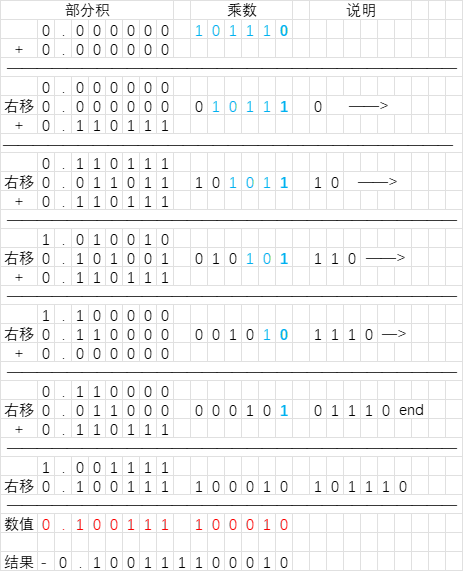
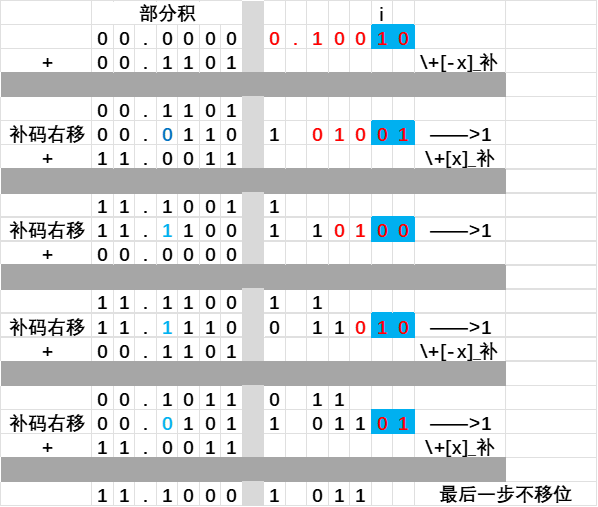
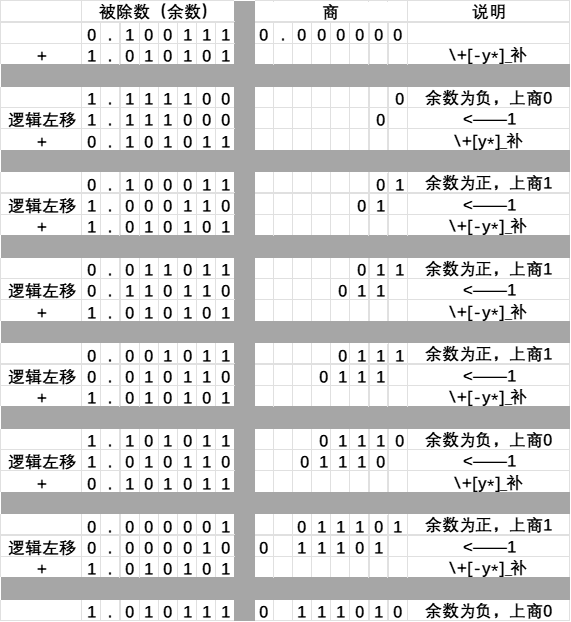

# 第三章

## 1

设机器数字长为 8 位（含一位符号位），已知
$$
A = \frac 9 {64}, B = - \frac {13} {32}
$$

用补码运算规则计算 $A + B$

答：
$$
A = 9/64 = 0.001001 \\
B = -13/32 = -0.011010 \\
A_{补} = 0.001001, B_{补} = 1.100110 \\
$$

$$
x + y = -0.010001 = - \frac {17} {64}
$$

## 2

用原码一位乘计算 $x \cdot y$
$$
x = 0.110111 \\
y = -0.101110
$$

答：
$$
x_0 = 0, y_0 = 1, x_0 \oplus y_0 = 1 \\
x* = 0.110111, y* = 0.101110
$$

结果为 $-0.100111100010$。

## 3

用 Booth 算法，采用双符号位计算 $[x * y]_{补}$
$$
x = -0.1101 \\
y = 0.1001
$$

答：
$$
[x]_{补} = 1.0011 \\
[-x]_{补} = 0.1101 \\
[y]_{补} = 0.1001
$$

| $y_i$ | $y_{i+1}$ | $y_i'= y_{i+1} - y_i$ |      操作       |
| :---: | :-------: | :-------------------: | :-------------: |
|   0   |     0     |           0           |       —>1       |
|   0   |     1     |           1           | +$[x]_{补}$—>1  |
|   1   |     0     |          -1           | +$[-x]_{补}$—>1 |
|   1   |     1     |           0           |       —>1       |

所以，$[x \times y]_{补} = 11.10001011$。

## 4

用 Booth 算法，采用双符号位计算 $x * y$
$$
x = 11011 \\
y = -11101
$$

答：
$$
[x]_{补} = 0,11011 \\
[-x]_{补} = 1,00101 \\
[y]_{补} = 1,00011
$$

| $y_i$ | $y_{i+1}$ | $y_i'= y_{i+1} - y_i$ |      操作       |
| :---: | :-------: | :-------------------: | :-------------: |
|   0   |     0     |           0           |       —>1       |
|   0   |     1     |           1           | +$[x]_{补}$—>1  |
|   1   |     0     |          -1           | +$[-x]_{补}$—>1 |
|   1   |     1     |           0           |       —>1       |

所以，$[x \times y]_{补} = 1,0011110001, x \times y = -1100001111$。

## 5

用原码加减交替法计算 $x \div y$
$$
x = 0.100111 \\
y = 0.101011
$$

答：
$$
[x]_{原} = 0.100111 \\
[y]_{原} = 0.101011 \\
[x*]_{补} = 0.100111 \\
[y*]_{补} = 0.101011 \\
[-y*]_{补} = 1.010101 \\
$$

1. $x_0 \oplus y_0 = 0 \oplus 0 = 0$
2. $\frac {x*} {y*} = 0.111010$

所以，$\frac {x} {y} = 0.111010$

## 6

假设阶码取 3 位，尾数取 6 位（均不包括符号位）采用双符号位计算
$$
[2^5 \times \frac {11} {16}] + [2^4 \times (- \frac {9} {16})]
$$
（要求：对阶和右归导致的尾数末尾精度损失**无需做任何舍入处理**）

答：
$$
[x]_{补} = 00,101;00.101100 \\
[y]_{补} = 00,100;11.011100
$$

1. 对阶

$[\Delta j]_{补} = [j_x]_{补} - [j_y]_{补} = 00,001$

阶差为 1，所以 $S_y \rightarrow 1, j_y + 1$

$[y]_{补}' = 00,101;11.101110$

2. 尾数求和

所以 $[x + y]_{补} = 00,101;00.011010$

3. 规格化——左规

左规后：$[x + y]_{补} = 00,100;00.110100$

所以，$x + y = 0.110100 \times 2^{100} = \frac {13} {16} \times 2^4$