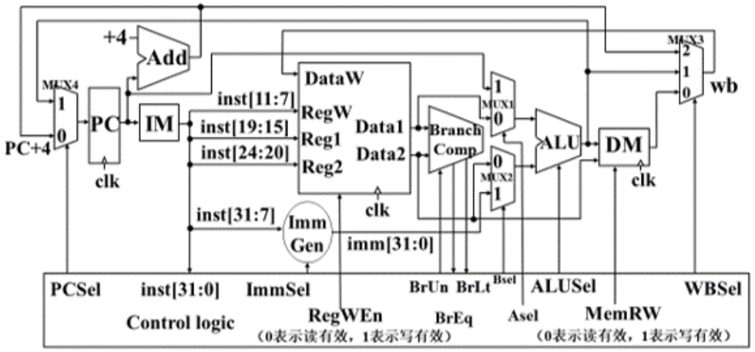

# 第四章 & 第五章

## 1

下面语句一定存在哪种风险：

```asm
ld x31, 0(x20)
add x31, x31, x21
```

答：数据冒险，载入-使用型数据冒险(load-use data hazard)，很典型的使用停顿的情况，需要停顿。选 B。

## 2

假设指令由取指、译码、执行 3 个子部件完成，并且每个子部件执行时间都是 t，对于流水线处理机，连续执行 8 条指令，则流水线加速比是：

答：

- 负载为 8；
- 非流水线时间：8* 3t = 24t；流水线时间：8t + 2t = 10t；
- 流水线加速比：24t / 10t = 2.4；

选 D。

## 3

| R-type | I-type(non ld) | Load | Store | Branch | Jump |
| :----: | :------------: | :--: | :---: | :----: | :--: |
|  24%   |      28%       | 25%  |  10%  |  11%   |  2%  |

答：

1. 发生数据访存的指令所占比例是 Load，Store；25% + 10% = 35%
2. 发生指令访存的指令所占比例是 R，I，Load，Store，B，J；100%
3. 使用符号位拓展的指令所占比例是 I，Load，Store，B，J；76%

## 4

4. 当不需要符号位拓展的结果时，符号拓展单元的行为是什么？

   A. 每个时钟周期还是有输入和输出，但输出没有意义，不会被选通参与 ALU 计算

   B. 不接收任何输入，不采取任何处理

答：选 A，其他单元在不使用的时候也是一样的道理。

## 5

假设数据通路各个流水线阶段的延迟如下：

|  IF   |  ID   |  EX   |  MEM  |  WB   |
| :---: | :---: | :---: | :---: | :---: |
| 250ps | 350ps | 150ps | 300ps | 200ps |

（1）在非流水化的处理器中，时钟周期是——ps。

（2）在流水化的处理器中，时钟周期是——ps。

（3）在非流水化和流水化的处理器中，一条 ld 指令的完整执行时间分别为——ps和——ps

答：

（1）非流水化：取五个阶段时长之和，也即最大值：(250 + 350 + 150 + 300 + 200) ps = 1250 ps

（2）流水化：350 ps。

乱写的：

- ~~250 ps~~
- ~~用加速比反推，加速比为流水线中步骤数，为 5；~~
  
- ~~那么时钟周期就为 x ps：1250 / x = 5，得 x = 250；~~


应该是：取决于时间最长的阶段，也就是 ID，为 350 ps。

（3）

非流水化：ld 指令包含所有五个阶段，故时间为 1250 ps；

流水化：~~一般来说只多不少？也是 1250 ps。~~ 应该是 5 个阶段的时长之和，即 5 * 350 ps = 1750 ps。

所以填：（1）1250 （2）350 （3）1250 1750

## 6

（4）如果要将数据通路中的一个流水级拆成两个新的流水级，每个新流水级的延迟为原来的一半，那么我们将拆分哪一级？——（从IF、ID、EX、MEM、WB中选择一个填空）。此时新的处理器时钟周期为——ps。

答：

把 ID 拆开，这样一来时间最长的阶段就是 MEM 300 ps，所以新的处理器周期为 300 ps。

## 7

假设本周期处理器取来指令：0x00c6ba23。问：

（1）此时 ALU 执行什么运算？

（2）此时 ALU 的两个输入端分别是？

（3）该指令执行结束后 PC 如何变化？

答：

- 0x00c6ba23：0000 0000 1100 0110 1011 1010 0010 0011：

  - opcode：010 0011，故为 S 型指令；

  - | imm[11:5] |  rs2  |  rs1  | func3 | imm[4:0] |  opcode  |
    | :-------: | :---: | :---: | :---: | :------: | :------: |
    | 0000 000  | 01100 | 01101 |  011  |  10100   | 010 0011 |

  - imm = 0000 000 10100 = 20；

  - rs1：01101，即 x13；rs2：01100，即 x12；

  - func3：sd；

  - 故指令为：sd rs2, offset(rs1)：**sd x12, 20(x13)**

（1）加法运算；

（2）x13(rs1) 和 拓展后的立即数 0000 0001 0100；

（3）加 4。

## 8

在下述代码中添加最少的 NOP 指令，让它无须处理数据冒险也能正确运行在流水线处理器上。

**（注意：同一时钟周期内，寄存器可以进行先写后读）**

```asm
addi x11, x12, 5
add  x13, x11, x12
addi x14, x11, 15
add  x15, x13, x12 
```

答：

不让使用前递，也没有流水线寄存器，看起来不能指令重排，就只能硬等到 WB 结束，还好有同一时钟周期内先写后读。

|         inst         | time |  >   |  >   |  >   |  >   |  >   |  >   |  >   |  >   |  >   |
| :------------------: | :--: | :--: | :--: | :--: | :--: | :--: | :--: | :--: | :--: | :--: |
|  addi **x11**, x12, 5  |  IF  |  ID  |  EX  | MEM  |  WB  |      |      |      |      |      |
| add  **x13**, **x11**, x12 |      |  IF  |  ID  |  EX  | MEM  |  WB  |      |      |      |      |
| addi x14, **x11**, 15 |      |      |  IF  |  ID  |  EX  | MEM  |  WB  |      |      |      |
| add  x15, **x13**, x12 |      |      |      |  IF  |  ID  |  EX  | MEM  |  WB  |      |      |

变为：

|            inst            | time |  >   |  >   |  >   |   >    |  >   |  >   |   >    |  >   |  >   |  >   |
| :------------------------: | :--: | :--: | :--: | :--: | :----: | :--: | :--: | :----: | :--: | :--: | :--: |
|    addi **x11**, x12, 5    |  IF  |  ID  |  EX  | MEM  | **WB** |      |      |        |      |      |      |
| add  **x13**, **x11**, x12 |      |      |      |  IF  | **ID** |  EX  | MEM  | **WB** |      |      |      |
|   addi x14, **x11**, 15    |      |      |      |      |   IF   |  ID  |  EX  |  MEM   |  WB  |      |      |
|   add  x15, **x13**, x12   |      |      |      |      |        |      |  IF  | **ID** |  EX  | MEM  |  WB  |

补上 nop，或者叫 bubble：

|            inst            | time |  >   |  >   |  >   |   >    |  >   |  >   |   >    |  >   |  >   |  >   |
| :------------------------: | :--: | :--: | :--: | :--: | :----: | :--: | :--: | :----: | :--: | :--: | :--: |
|    addi **x11**, x12, 5    |  IF  |  ID  |  EX  | MEM  | **WB** |      |      |        |      |      |      |
|            nop             |      |  x   |  x   |  x   |   x    |  x   |      |        |      |      |      |
|            nop             |      |      |  x   |  x   |   x    |  x   |  x   |        |      |      |      |
| add  **x13**, **x11**, x12 |      |      |      |  IF  | **ID** |  EX  | MEM  | **WB** |      |      |      |
|   addi x14, **x11**, 15    |      |      |      |      |   IF   |  ID  |  EX  |  MEM   |  WB  |      |      |
|            nop             |      |      |      |      |        |  x   |  x   |   x    |  x   |  x   |      |
|   add  x15, **x13**, x12   |      |      |      |      |        |      |  IF  | **ID** |  EX  | MEM  |  WB  |

所以答案是：（内心告诉自己画一下周期图绝对是没错的呜呜，然而错不错和画图关系不太大）

```asm
addi x11, x12, 5
nop
nop
add  x13, x11, x12
addi x14, x11, 15
nop
add  x15, x13, x12
```

## 9

请根据下面的数据通路图回答问题。


（1）根据以下指令，分别在表格空白处填写数据通路控制信号（填入 0、1或 2，如果 0 和 1 都可以的话用＊表示）。

|        指令        | Asel | Bsel |  WBSel  |  PCSel   | RegWEn | MemRW |
| :----------------: | :--: | :--: | :-----: | :------: | :----: | :---: |
| `beq x0, x0, Loop` |  PC  | imm  |    *    | PC + imm |  read  | read  |
|  `lw x5, 0(x29)`   | rs1  | imm  | from DM |  PC + 4  | write  | read  |



对应到本题图：

|        指令        | Asel | Bsel | WBSel | PCSel | RegWEn | MemRW |
| :----------------: | :--: | :--: | :---: | :---: | :----: | :---: |
| `beq x0, x0, Loop` |  1   |  1   |   *   |   1   |   0    |   0   |
|  `lw x5, 0(x29)`   |  0   |  1   |   0   |   0   |   1    |   0   |

## 10

（2）

指令 1：`beq x0, x0, Loop`

指令 2：`lw x5, 0(x29)`

发生数据访存（DMEM）的指令有哪些？

答：指令 2，故选 B。

## 11

（3）发生指令访存（IMEM）的指令有哪些？

答：都是，故选 C。

## 12

（4）使用符号位拓展的指令有哪些？

答：都是，故选 C。

## 13

（5）对于指令 `lw x5, 0(x29)`，如果 MemRW 控制线出错并且 MemRW = 1， 则执行该指令时会发生什么？

答：

DM 的两个输入端是：x0 和 0(x29)，那么 DM（主存）中 0(x29) 的位置将被赋为 0，但这是下一个时钟上升沿的事情；

本个时钟中，DM 的输出端在 write 时高阻态，所以 x5 并没有获得它应该被赋的值。
