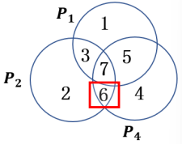
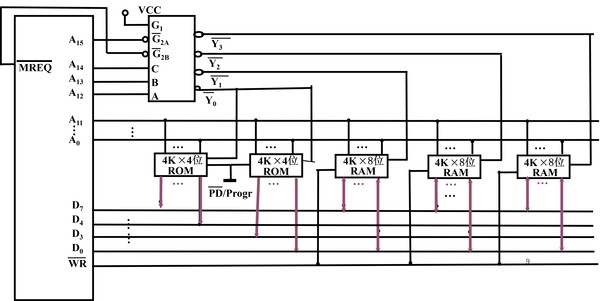

# 第六章

## 1

试从七个方面比较静态 RAM 和动态 RAM 不同点（基本存储元件、集成度、芯片引脚、功耗、价格、速度、有无刷新）。

答：

|                          | 缓存：静态 RAM(SRAM) | 主存：动态 RAM(DRAM) |
| :----------------------: | :------------------: | :------------------: |
| 基本存储元件（存储原理） |        触发器        |         电容         |
|          集成度          |          低          |          高          |
|         芯片引脚         |          多          |          少          |
|           功耗           |          大          |          小          |
|           价格           |          高          |          低          |
|           速度           |          快          |          慢          |
|         有无刷新         |          无          |          有          |

## 2

DRAM 的刷新有哪三种方式？为什么要刷新？ 

答：

- 集中刷新、分散刷新分散刷新与集中刷新相结合（异步刷新）；

- DRAM 的存储原理是电容存储电荷，电容存储电荷的方式存储“0”和“1” 电容易漏电，长期得不到访问的存储单元的原信息会慢慢消失；刷新是一种再生过程：先将原存信息读出，再由刷新放大器形成原信息并重新写入。

## 3

写出以下代码对应的汉明码：

1）1000 按**配偶原则**生成的汉明码是［填空1］

2）1000 按**配奇原则**生成的汉明码是［填空2］

答：

1）

因为 n = 4，根据 $2^k \ge n + k + 1$，得 k = 3

汉明码排序如下：

| 二进制序号 |   1   |   2   |  3   |   4   |  5   |  6   |  7   |
| :--------: | :---: | :---: | :--: | :---: | :--: | :--: | :--: |
|    名称    | $C_1$ | $C_2$ |  1   | $C_4$ |  0   |  0   |  0   |
|  配偶原则  |   1   |   1   |      |   0   |      |      |      |

$$
C_1 = 位_3 \oplus 位_5 \oplus 位_7 = 1 \oplus 0 \oplus 0 = 1 \\
C_2 = 位_3 \oplus 位_6 \oplus 位_7 = 1 \oplus 0 \oplus 0 = 1 \\
C_4 = 位_5 \oplus 位_6 \oplus 位_7 = 0 \oplus 0 \oplus 0 = 0
$$

所以 1000 按**配偶原则**生成的汉明码是 1110 000；

2）

由题，知：
$$
C_1 = \overline {位_3 \oplus 位_5 \oplus 位_7 = 1 \oplus 0 \oplus 0} = 0 \\
C_2 = \overline {位_3 \oplus 位_6 \oplus 位_7 = 1 \oplus 0 \oplus 0} = 0 \\
C_4 = \overline {位_5 \oplus 位_6 \oplus 位_7 = 0 \oplus 0 \oplus 0} = 1
$$

| 二进制序号 |   1   |   2   |  3   |   4   |  5   |  6   |  7   |
| :--------: | :---: | :---: | :--: | :---: | :--: | :--: | :--: |
|    名称    | $C_1$ | $C_2$ |  1   | $C_4$ |  0   |  0   |  0   |
|  配奇原则  |   0   |   0   |      |   1   |      |      |      |

所以 1000 按**配奇原则**生成的汉明码是 0011 000。

## 4

以下是接收到的汉明码按**配偶原则**配置，则：

1）1100100 的第［填空1］位出错，欲传送的原始代码是［填空2］

2）1100111 的第［填空3］位出错，欲传送的原始代码是［填空4］

答：

1）

纠错过程如下：
$$
\begin{equation} \begin{split}
P_1 = 位_1 \oplus 位_3 \oplus 位_5 \oplus 位_7 = 0 无错 \\
P_2 = 位_2 \oplus 位_3 \oplus 位_6 \oplus 位_7 = 1 有错 \\
P_4 = 位_4 \oplus 位_5 \oplus 位_6 \oplus 位_7 = 1 有错
\end{split} \end{equation}
$$

所以 $P_4 P_2 P_1 = 110$，第六位出错，可纠正为 1100110；

2）

纠错过程如下：
$$
\begin{equation} \begin{split}
P_1 = 位_1 \oplus 位_3 \oplus 位_5 \oplus 位_7 = 1 无错 \\
P_2 = 位_2 \oplus 位_3 \oplus 位_6 \oplus 位_7 = 1 有错 \\
P_4 = 位_4 \oplus 位_5 \oplus 位_6 \oplus 位_7 = 1 有错
\end{split} \end{equation}
$$

所以 $P_4 P_2 P_1 = 111$，第七位出错，可纠正为 1100110；

## 5

设 CPU 共有 16 根地址线，8 根数据线，并用 $\overline{MREQ}$（低电平有效）作访存控制信号，$R / \bar W$ 作读／写命令信号（高电平为读，低电平为写）。

现有这些存储芯片：

ROM（2K x 8位，4K x 4位，8K x 8位）；

RAM（1K x 4位，2K x 8位，4K x 8位）；

及 74138 译码器和其他门电路（门电路自定）。

试从上述规格中选用合适的芯片，画出CPU和存储芯片的连接图。要求如下：

（1）最小 4K 地址为系统程序区，4096～16383 地址范围为用户程序区。

（2）**指出选用的存储芯片类型及数量**。

（3）**详细画出片选逻辑**。

答：

（1）写出对应的二进制地址码，（2）确定芯片的数量及类型

0 ~ 4K - 1 为系统程序区，4K ~ 16K - 1 为用户程序区；

系统程序区：使用两个 4K x 4 位的 ROM；（位拓展比字拓展容易一些？）

用户程序区：共 12K 的用户程序，使用 3 个 4K x 8 位的 RAM。

（3）分配地址线

$A_{11} - A_0$ 接 4K x 4 位的 ROM 的地址线；

$A_{11} - A_0$ 接 4K x 8 位的 RAM 的地址线；

$A_{13}, A_{12}, A_{11}$ 接 74138 译码器的 C，B，A。

|            |  A15  |  A14  |  A13  |  A12  | A11  | A10  |  A9  |  A8  |  A7  |  A6  |  A5  |  A4  |  A3  |  A2  |  A1  |  A0  |                          |
| :--------: | :---: | :---: | :---: | :---: | :--: | :--: | :--: | :--: | :--: | :--: | :--: | :--: | :--: | :--: | :--: | :--: | :----------------------: |
|     ——     | **0** | **0** | **0** | **0** |  0   |  0   |  0   |  0   |  0   |  0   |  0   |  0   |  0   |  0   |  0   |  0   |                          |
| 第一个 4K  |  ...  |       |       |       |      |      |      |      |      |      |      |      |      |      |      |      |     4K x 8 位的 ROM      |
|     ——     | **0** | **0** | **0** | **0** |  1   |  1   |  1   |  1   |  1   |  1   |  1   |  1   |  1   |  1   |  1   |  1   | （两片 4K x 4 位的 ROM） |
|     ——     |   0   |   0   |   0   |   1   |  0   |  0   |  0   |  0   |  0   |  0   |  0   |  0   |  0   |  0   |  0   |  0   |                          |
| 第二个 4K  |  ...  |       |       |       |      |      |      |      |      |      |      |      |      |      |      |      |   4K x 8 位的 RAM 一片   |
|     ——     |   0   |   0   |   0   |   1   |  1   |  1   |  1   |  1   |  1   |  1   |  1   |  1   |  1   |  1   |  1   |  1   |                          |
|     ——     |   0   |   0   |   1   |   0   |  0   |  0   |  0   |  0   |  0   |  0   |  0   |  0   |  0   |  0   |  0   |  0   |                          |
| 第三个 4K  |  ...  |       |       |       |      |      |      |      |      |      |      |      |      |      |      |      |   4K x 8 位的 RAM 一片   |
|     ——     |   0   |   0   |   1   |   1   |  1   |  1   |  1   |  1   |  1   |  1   |  1   |  1   |  1   |  1   |  1   |  1   |                          |
|     ——     |   0   |   1   |   0   |   0   |  0   |  0   |  0   |  0   |  0   |  0   |  0   |  0   |  0   |  0   |  0   |  0   |                          |
| 第四个 4K  |  ...  |       |       |       |      |      |      |      |      |      |      |      |      |      |      |      |   4K x 8 位的 RAM 一片   |
|     ——     |   0   |   1   |   1   |   1   |  1   |  1   |  1   |  1   |  1   |  1   |  1   |  1   |  1   |  1   |  1   |  1   |                          |
| 地址线分配 |       |   C   |   B   |   A   |      |      |      |      |      |      |      |      |      |      |      |      |                          |

（4）确定片选信号

## 6

设某机主存容量为 16MB，**按字节寻址**，其中 Cache 容量为 16KB，每字块有 8 个字，每字 32 位，设计一个**四路组相联映射**（即 Cache 每组内共有 4 个字块）的 Cache 组织。

（1）画出主存地址字段中各段的位数。

（2）设 Cache 的初态为空，CPU 依次从主存第 0，1，2，．．，89 号单元读出 90 个字（主存一次读出一个字），并重复按此次序读 8 次，问命中率是多少？

（3）若 Cache 的速度是主存的 6 倍，试问有 Cache 和无 Cache 相比，速度约提高多少倍。

（4）地址为 ABCDEFH 的主存单元会被映射到 Cache 中的第几组（**用十进制表示**，设起始组号为第 0 组）？

答：

（1）

- 由于主存按照字节寻址，故 Cache 寻址范围为 16K，得 Cache 地址为 14 位；

- 由于主存按照字节寻址，故主存寻址范围为 16M，得主存地址为 24 位；
- 字块内地址：8 * 32 / 8 = 32，即 5 位；
- Cache 组数：16 * 1024 * 8 / (4 * 8 * 32) = 128 组，即 7 位；

所以：

| 主存字块标记 | 组地址 | 字块内地址 |
| :----------: | :----: | :--------: |
|    12 位     |  7 位  |    5 位    |

（2）

因为一共 128 个组，所以主存 0 - 89 号单元的数据，会存到对应的 12 个组中；

第一次读字的时候 Cache 没有值，这一次是访问主存，之后 7 次都是访问 Cache，即命中；

命中率 = $\frac {8 \times 90 - 12} {8 \times 90} \times 100 \% = 98.33 \%$

（3）

有 Cache：$12 \times t_m + (8 \times 90 - 12) \times t_c$

无 Cache：$8 \times 90 \times t_m$

又 $t_m = 6 \times t_c$

所以 $\frac {8 \times 90 \times t_m} {12 \times t_m + (8 \times 90 - 12) \times t_c} = 5.538$

故速度提高曰 4.54 倍。

（4）

- ABCDEFH：1010 1011 1100 1101 1110 1111；

  - 主存字块标记：1010 1011 1100

  - 组地址：$1101 111 = 110 1111_{(2)} = 111_{(10)}$

  - 字块内地址：0 1111

所以是第 111 组。

## 7

设主存容量为 256K 字，Cache 容量为 2K 字，块长为 4 个字，每字 32 位，**按字寻址**，则：

（1）在直接映射方式下，设计主存地址格式。

（2）在四路组相联映射方式下，设计主存地址格式。

（3）在全相联映射方式下，设计主存地址格式。

答：

（1）

主存寻址范围为 256K，即 18 位；

Cache 寻址范围为 2K，即 11 位；

字块内 4 个字，只需要 2 位（00，01，10，11）；

字块数：2K (字) / 4 (字) = 512 块，即 9 位（也可以直接 11 - 2 = 9，Cache 本来就只有 11 位，2 位用于字块内，那么剩下 9 位就都是字块本身的地址编号了）。

| 主存字块标记 | 缓存字块地址 | 字块内地址 |
| :----------: | :----------: | :--------: |
|     7 位     |     9 位     |    2 位    |

（2）

四路就是 Cache 里一组 4 块；

Cache 里的组数：2K (字) / (4 * 4 (字)) = 128 组，即 7 位；

| 主存字块标记 | 组地址 | 字块内地址 |
| :----------: | :----: | :--------: |
|     9 位     |  7 位  |    2 位    |

（3）

| 主存字块标记 | 字块内地址 |
| :----------: | :--------: |
|    16 位     |    2 位    |

